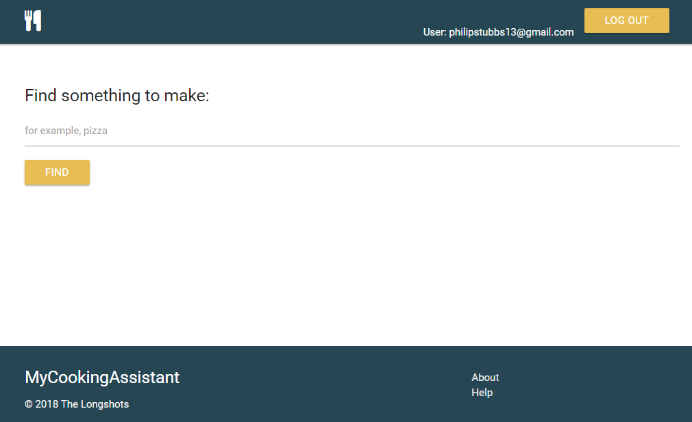
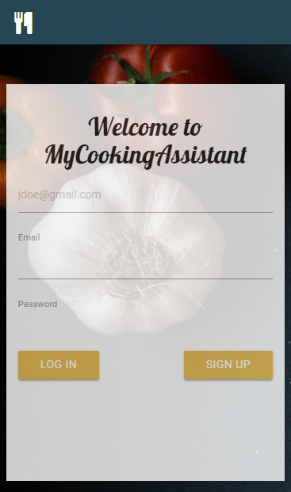
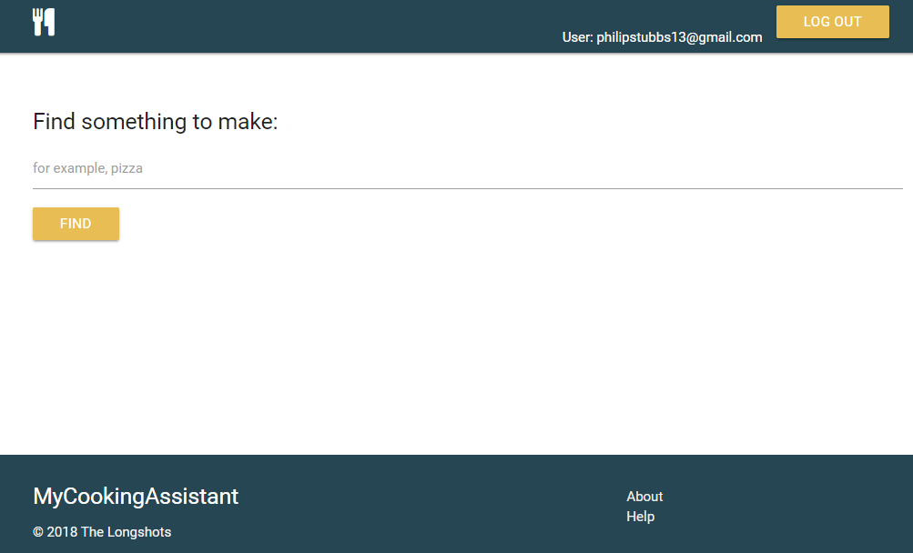
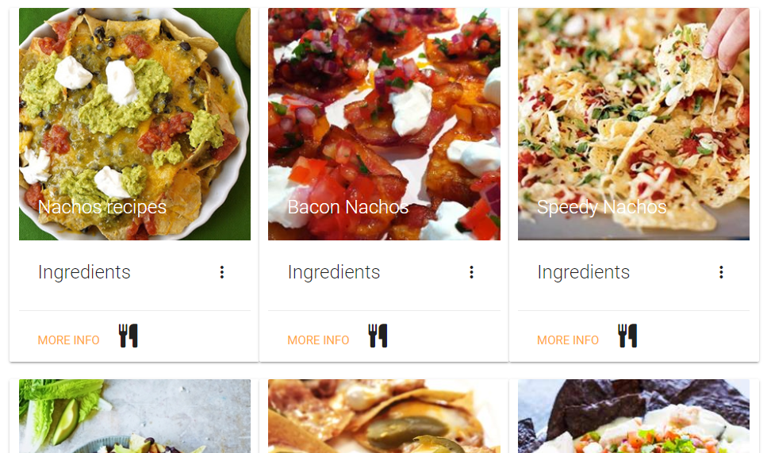

# Recipe Search App

Are you having guests over for dinner tonight and don't know what to make? Are you tired of having the same meals over and over and want to try something new?

The recipe search app is a search engine that returns the most relevant recipes from the most popular sites on the web.

With this app, you can

  <ul>
    <li>Search for a variety of recipes from many sources.</li>
    <li>Find out what ingredients you need to make a recipe.</li>
    <li>Favorite a recipe so that you can view it later.</li>
    <li>Unfavorite a recipe.</li>
    <li>Add your own personal notes to a recipe.</li>
  </ul>

## Table of contents
  * [About this project](#about-this-project)
  * [Live](#live)
  * [Contributors](#contributors)
  * [Getting started](#contribute)
  * [Structure of the project](#structure-of-project)
  * [Screenshots](#screenshots)
  * [Technologies used to create app](#technologies-used)
    * [Front end technologies](#front-end)
    * [Back end technologies](#back-end)
  * [About the Edamam Recipe Search API](#edamam-api)
  * [How to use the app](#how-to-use-app)
    * [Logging in](#authentication)
  	* [Searching for recipes](#recipe-search)
  	* [Revealing ingredients](#reveal-ingredients)
    * [Adding a recipe to your favorites](#add-recipe-to-favorites)
    * [Viewing favorite recipes in your Recipe box](#view-favorite-recipes)
    * [Removing favorite recipes](#remove-favorite-recipes)
    * [Adding notes to a recipe](#add-notes-to-recipe)
    * [Help information](#help-info)
  * [Future code development](#feature-enhancements)
  * [Known issues](#known-issues)
  * [Icons](#icons)
  * [Feedback](#feedback)

##  About this project

On the back end, this project uses the Edamam <a href="https://developer.edamam.com/edamam-docs-recipe-api" target="_blank">Recipe Search API</a> to create an app that returns the most relevant recipes from the most popular sites on the web. The API is accessed by using HTTPS GET requests on a query URL. When the request is complete, the API returns the result of the query (all the recipes about a particular food query) in JSON format. The app has a single search field where a user can enter a particular food item they want to make. The user input from the search field is used to construct the query URL and display 9 relevant recipes in the search results section of the app.

To create a personalized user experience, the app does require users to sign up for an account and log in to the app to use the app features. This app uses Firebase and an email/password sign-in method to authenticate users. Requiring users to log in allows users to save recipes they like (which are stored in Firebase on a per user basis) so that they can view these recipes at a later time. The app allows users to remove recipes from their favorite list as well as add notes to their favorite recipes. So, each user has their very own personal Recipe box. This information is stored in the Firebase database that's used for this project, so it is remembered each time a user logs in and logs out.

On the front end side, this project uses Materialize to help create the styling and layout of the app. Materialize is a css framework based on Material Design, a design language created and designed by Google. Read the Materialize <a href="http://materializecss.com/getting-started.html" target="_blank">Getting Started</a> documentation to learn more.

##  Live

App is available live through Firebase:

<Insert Firebase link here.>

##  Contributors
<li>Back end developer: Jon Moore</li>
<li>Back end developer: Ida Jensen</li>
<li>Front end developer: Maiyer Thao</li>
<li>Front end developer/Project Manager: Phil Stubbs</li>

##  Getting started
Run these commands to set up this project locally on your computer:
<pre>
  git clone https://github.com/philipstubbs13/Project-Longshot.git
  cd  Project-Longshot
</pre>

##  Structure of the project

After downloading the project files from GitHub, your directory should look something like this:

<ul>
	<li> <b>/public/assets/javascript</b>: This directory contains the Javascript to:
		<ul>
			<li>Initialize the Firebase database.</li>
			<li>Grab the user input from the search field when a user starts a recipe search.</li> 
      <li>Perform a jQuery AJAX GET request to retrieve the relevant recipe data using the Edamam API, including the recipe name, the list of ingredients, an external link to more information, and an image of the recipe.</li>
      <li>Display the recipe data in the search results section after the AJAX request is complete.</li>
      <li>Save, remove, and add notes to recipes.</li>
      <li>Trigger modals that are used in the app.</li>
      <li>Hide and show app features based on whether a user is logged in to the app or not.</li>
		</ul>
	</li>
	<li><b>/public/assets/css</b>: This directory contains the external stylesheet used for the app. Materialize is the css framework used for this project. </li>
	<li><b>/public/index.html</b>: This file contains the code for the HTML and Materialize css markup.</li>
	<li><b>firebase.json</b>: This file located in the root directory is the Firebase configuration file.</li>
	<li><b>/public/assets/images</b>: This directory contains images used for this project.</li>
	<li><b>database.rules.json</b>:This file contains the database rules that grant permissions to users who are logged into the app.</li>
</ul>

##  Screenshots

##  Technologies used to create app

  ###  Front end technologies
    * HTML5
    * CSS
    * Materialize (http://materializecss.com/)
    * Javascript
    * JQuery (https://jquery.com/)

  ###  Back end technologies
      * Firebase API for database hosting and email/password authentication (https://firebase.google.com/)
      * Edamam Recipe Search API (https://developer.edamam.com/edamam-recipe-api)

## About the Edamam Recipe Search API

To learn about the Edamam API and the various API parameters, read the <a href="https://developer.edamam.com/edamam-docs-recipe-api" target="_blank">Recipe Search API documentation</a>. You should be familiar with the API before contributing to this project or creating your own recipe search app.

Edamam requires developers to use a key (api_key) and an app id (app_id) to access API data. To use the Edamam API, you'll need a (free) Edamam developer account.

After you have an app key and id, you can use the API to search for recipes matching the specified query.

##  How to use the app

  ###  Logging in
  To get started using the app, you need to log in with your app credentials (email and password). If you don't have an account, you can sign up for one from the <b>Log in</b> screen.
  
  ###  Searching for recipes.
  To search for a recipe, enter the name of the food item (for example, pizza) you want to make in the <b>Find something to make</b> search field and click <b>FIND</b>.
  The app will return the top 9 recipes and information about those recipes, including ingredients, the external recipe source link, the recipe title, and an image of the recipe.

  ### <a name="reveal-ingredients"</a> Revealing ingredients
  To see a list of ingredients for a recipe, click the vertical ellipses icon next to that recipe in the search results to reveal the ingredients.

  ###  Adding a recipe to your favorites
  To favorite a recipe, click the cutlery icon next to that recipe in the search results. After you favorite a recipe, it is added to your Recipe box.

  ###  Viewing favorite recipes in your Recipe box
  The Recipe box is where you can view your favorite recipes. You must be logged in to use this feature as the Recipe box will be different from user to user. After you are logged in, you can view favorite recipes by clicking the cutlery icon in the top navigation bar.

  ###  Removing favorite recipes
  To remove a favorite recipe, open your Recipe box by clicking the cutlery icon in the top navigation bar and then click the trash icon next to the recipe you want to remove.

  ###  Adding notes to a recipe
  To add notes to a favorite recipe, open your Recipe box by clicking the cutlery icon in the top navigation bar and then click the pencil icon next to the recipe you want to edit.

  ###  Help information
  Additional help information is available within the app by clicking <b>Help</b> in the footer.

##  Future code development

Source code will be developed over time to handle new features in the future.

The following is a list of potential user stories for a future sprint:

  <ul>
    <li>Add a feature to the app that allows users to import their own recipes. For example, if a user has a hand written recipe or a recipe they want to share, they can import their recipe into the app to save it in case the hand written one gets thrown away or lost.</li>
    <li>Add additional search parameters that allows users to search for recipes based on the ingredients they already have in their homes.</li>
    <li>Add Facebook and other social authentication options to allow users to log in with their social media accounts and easily share recipes with others.</li>
    <li>Integrate the Edamam Nutrition Analysis API to show users the nutritional content of meals and recipes.</li>
    <li>Increase the search results limit. Currently, the app returns the top 9 recipes.</li>
  </ul>

##  Known issues

The following are known issues to be addressed in a future code update.

If you find an issue while using the app, <a href="https://github.com/philipstubbs13/Project-Longshot/issues/" target="_blank">file an issue</a>.

##  Icons
All icons used for this project can be obtained from <a href="http://fontawesome.io/icons/" target="_blank">Font Awesome</a> or <a href="https://www.iconfinder.com/" target="_blank">Iconfinder</a>.

##  Feedback

If you find an issue while using the app or have a request for a feature that you would like to see implemented, log the issue or request <a href="https://github.com/philipstubbs13/Project-Longshot/issues/" target="_blank">here.</a>

